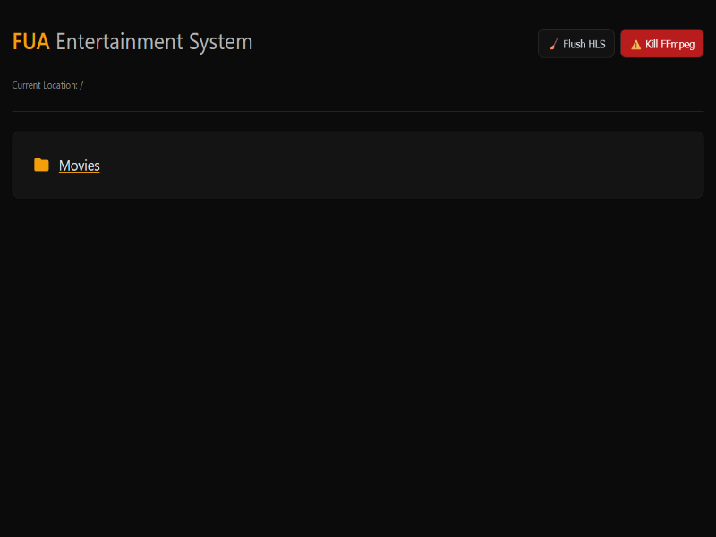
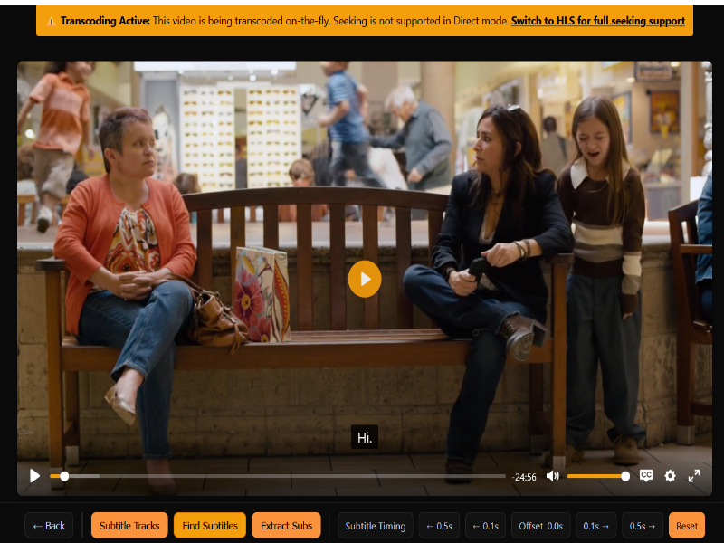
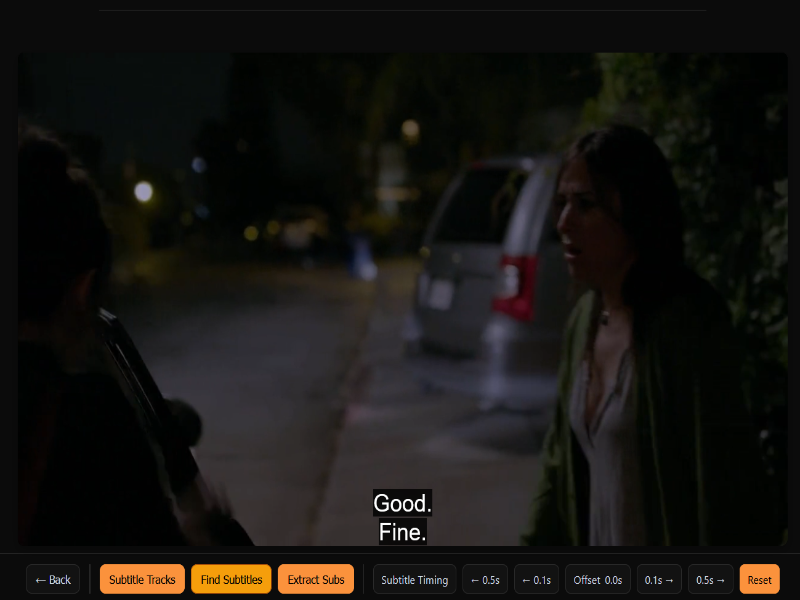

# FUA Entertainment System

A modern, web-based media streaming and management system built with Python and Flask. Stream your media collection with support for multiple video formats, HLS streaming, and OpenSubtitles integration.


<div style="display: flex; gap: 10px;">
  
  
  
</div>

## Known issues
- Subtitles not working correctly on Apple Devices.
- Android TV and Android mobile have issues handling URLs
Working on a fix soon, Stay tuned

## ✨ Features

- 🎥 **Media Streaming**
  - Direct playback of common video formats
  - On-the-fly HLS transcoding for unsupported formats
  - Adaptive bitrate streaming
  - Support for multiple media folders

- 🌍 **Subtitles**
  - Integrated OpenSubtitles.com support
  - Automatic subtitle search and download
  - Subtitle timing adjustment
  - Multiple language support

- 📚 **Player Controls**
  - Custom video player with intuitive controls
  - Playback speed adjustment
  - Fullscreen support
  - Keyboard shortcuts

## 💾 HLS Stream Management

The application uses HTTP Live Streaming (HLS) for adaptive streaming of video content. Here's how it works:

### Storage Location
- HLS streams are stored in your system's temporary directory under `hls_streams` (e.g., `C:\Users\[USERNAME]\AppData\Local\Temp\hls_streams` on Windows or `/tmp/hls_streams` on Unix-like systems)
- Each stream gets its own subdirectory with a unique ID
- Streams are automatically cleaned up when they become inactive

### Stream Management
- **No Duplicates**: The system reuses existing streams for the same media file
- **Efficient Caching**: Active streams are kept in memory for quick access
- **Automatic Cleanup**: Inactive streams are automatically removed to save space
- **Manual Controls**:
  - **Clear All Streams**: Removes all HLS streams and temporary files
  - **Kill FFmpeg Processes**: Terminates all running FFmpeg processes
  - Access these controls from the administration section on the index page

### Cleanup Process
The system includes a robust cleanup mechanism that:
1. Runs periodically (default: every 30 minutes)
2. Removes streams that haven't been accessed for a while (default: 4 hours)
3. Considers a stream active if accessed within the last 5 minutes
4. Cleans up both the process and temporary files

### Configuration Options
You can adjust these settings in either `.env` or `config.py`:

- Use `.env` for basic configuration (recommended for most users)
- Use `config.py` for advanced customization and development

Example `.env` settings:
```ini
# HLS segment duration in seconds (default: 4)
HLS_SEGMENT_DURATION=4

# How often to check for inactive streams in seconds (default: 1800 = 30 minutes)
HLS_CLEANUP_INTERVAL=1800

# Remove streams inactive for this many seconds (default: 14400 = 4 hours)
HLS_INACTIVE_TIMEOUT=14400

# Consider a stream active if accessed within this many seconds (default: 300 = 5 minutes)
HLS_ACTIVE_THRESHOLD=300
```

- 🔧 **Technical Features**
  - Hardware-accelerated transcoding (NVIDIA/Intel/AMD)
  - Background HLS segment cleanup
  - Responsive design
  - Configurable settings

## 🚀 Quick Start

### Prerequisites

- Python 3.8+
- FFmpeg (with hardware acceleration if available)
- OpenSubtitles.com API key (for subtitle support)

### Installation

1. Clone the repository:
   ```bash
   git clone https://github.com/ZPlanOrBust/FUA_EntertainmentSystem.git
   cd FUA_EntertainmentSystem
   ```

2. Create and activate a virtual environment:
   ```bash
   python -m venv venv
   source venv/bin/activate  # On Windows: venv\Scripts\activate
   ```

3. Install the required dependencies:
   ```bash
   pip install -r requirements.txt
   ```

4. Configure your environment:
   - Copy `.env.example` to `.env`
   - Edit `.env` to customize settings (or modify `config.py` for more advanced configuration)
   - Set your media folder path(s) in `.env`:
     ```ini
     # Set your media folder paths (separate multiple paths with semicolons)
     # Example for Windows:
     MEDIA_FOLDERS=C:\Users\YourUsername\Videos;D:\Movies
     
     # Example for Linux/macOS:
     # MEDIA_FOLDERS=/home/username/Videos;/media/username/ExternalDrive/Movies
     ```
   - Review other settings in `.env` (see Configuration section below)

5. Launch the application:
   ```bash
   # Option 1: Run directly
   python run.py
   
   # Option 2: Use Flask's development server
   # (Make sure to set FLASK_APP=run.py and FLASK_ENV=development)
   # flask run --host=0.0.0.0 --port=5000
   ```

6. Open your browser and navigate to `http://localhost:5000`

## ⚙️ Configuration

Edit the `.env` file to customize the application settings:

```ini
# Media Folders (semicolon-separated)
MEDIA_FOLDERS=D:\Movies;E:\TV Shows

# OpenSubtitles API Configuration
# Sign up at https://www.opensubtitles.com/ to get your API key
# Use your OpenSubtitles.com account credentials for username and password
OPENSUBTITLES_API_KEY=your_api_key  # Required for subtitle functionality
OPENSUBTITLES_USERNAME=your_username  # Your OpenSubtitles.com username
OPENSUBTITLES_PASSWORD=your_password  # Your OpenSubtitles.com password
OPENSUBTITLES_USER_AGENT=FUA_EntertainmentSystem/1.0.0  # Must be unique and identify your app

## 🌍 Managing Subtitle Languages

The application supports multiple languages for subtitles. Here's how to manage them:

### Adding or Removing Languages

1. Open `new_app/config.py` in a text editor
2. Locate the `SUPPORTED_LANGUAGES` dictionary in the `Config` class
3. Add or remove language entries using ISO 639-1 language codes

Example:
```python
SUPPORTED_LANGUAGES = {
    'en': 'English',
    'ar': 'العربية',  # Arabic
    'es': 'Español',  # Spanish
    'fr': 'Français',  # French
    # Add more languages as needed
}
```

### Setting the Default Language

You can set the default language by modifying the `DEFAULT_LANGUAGE` variable in `config.py`:

```python
# Default language code for subtitles (must be one of the keys in SUPPORTED_LANGUAGES)
DEFAULT_LANGUAGE = 'en'  # Change to your preferred default language code
```

### Notes
- The language code should be a valid ISO 639-1 code
- The language name will be displayed in the language selector dropdown
- The default language will be pre-selected when opening the subtitle search
- Changes require restarting the application to take effect

## Transcoding Settings
TRANSCODING_DEVICE=auto  # auto, nvenc, qsv, vaapi, or software
HLS_SEGMENT_DURATION=4
HLS_CLEANUP_INTERVAL=300
HLS_INACTIVE_TIMEOUT=3600

# Player Settings
DEFAULT_PLAYBACK_MODE=auto  # auto, direct, or hls
```

## 🎮 Usage

### Browsing Media
- The home page displays all video files from your configured media folders
- Click on any video to start playback
- Use the search bar to find specific videos

### Player Controls
- **Space**: Play/Pause
- **Arrow Left/Right**: Seek -10/+10 seconds
- **Arrow Up/Down**: Volume up/down
- **F**: Toggle fullscreen
- **M**: Mute/unmute
- **0-9**: Jump to percentage of video (0=0%, 9=90%)

### Subtitles
- Click the "Find Subtitles" button to search for available subtitles
- Select your preferred language
- Adjust timing if needed using the Subtitle Timing controls

## 🤝 Contributing

1. Fork the repository
2. Create a new branch (`git checkout -b feature/AmazingFeature`)
3. Commit your changes (`git commit -m 'Add some AmazingFeature'`)
4. Push to the branch (`git push origin feature/AmazingFeature`)
5. Open a Pull Request

## 🔒 Security Considerations

### Securing Your .env File
- Never commit your `.env` file to version control
- Add `.env` to your `.gitignore` file
- Set appropriate file permissions (e.g., `chmod 600 .env` on Unix-like systems)
- In production, consider using environment variables directly or a secure secret management system

### OpenSubtitles API Rate Limits
- The OpenSubtitles API enforces rate limits:
  - 200 requests per 10 seconds per IP (20 requests per second)
  - 400 requests per 10 seconds for VIP users
- The application includes automatic rate limiting and retry logic
- For heavy usage, consider using a proxy or VPN to avoid hitting rate limits

## ⚡ Performance Tuning

### Hardware Acceleration

The application supports several hardware-accelerated encoding options to improve transcoding performance. Configure these in your `.env` file:

```ini
# Available options: auto, nvenc (NVIDIA), qsv (Intel Quick Sync), vaapi (AMD/Intel), software
TRANSCODING_DEVICE=auto
```

#### NVIDIA GPU Acceleration (NVENC)
1. Install NVIDIA drivers and CUDA toolkit
2. Install FFmpeg with NVENC support
3. Set `TRANSCODING_DEVICE=nvenc` in `.env`

#### Intel Quick Sync (QSV)
1. Enable Intel Quick Sync in BIOS
2. Install Intel Media SDK
3. Set `TRANSCODING_DEVICE=qsv` in `.env`

#### VA-API (AMD/Intel)
1. Install VA-API drivers
2. Set `TRANSCODING_DEVICE=vaapi` in `.env`

### Performance Optimization Tips

1. **Segment Settings**
   - Decrease `HLS_SEGMENT_DURATION` for lower latency (but higher CPU usage)
   - Increase for better performance (default: 4 seconds)

2. **Concurrent Streams**
   - Limit the number of concurrent transcodes based on your hardware
   - Monitor system resources to find the optimal balance

3. **Storage**
   - Use SSDs for better I/O performance during transcoding
   - Ensure sufficient free space in the temporary directory for HLS segments

4. **Network**
   - For remote streaming, ensure sufficient network bandwidth
   - Consider using a CDN for serving HLS content in production

5. **Monitoring**
   - Monitor CPU/GPU usage during transcoding
   - Adjust settings based on your specific hardware capabilities

## 📄 License

This project is licensed under the MIT License - see the [LICENSE](LICENSE) file for details.

## 🙏 Acknowledgments

- [Flask](https://flask.palletsprojects.com/) - The web framework used
- [FFmpeg](https://ffmpeg.org/) - For video transcoding
- [OpenSubtitles](https://www.opensubtitles.com/) - For subtitle support
- [Plyr](https://github.com/sampotts/plyr) - For the video player UI

---

Made with ❤️ by the [Abdulaziz](https://github.com/ZPlanOrBust)
